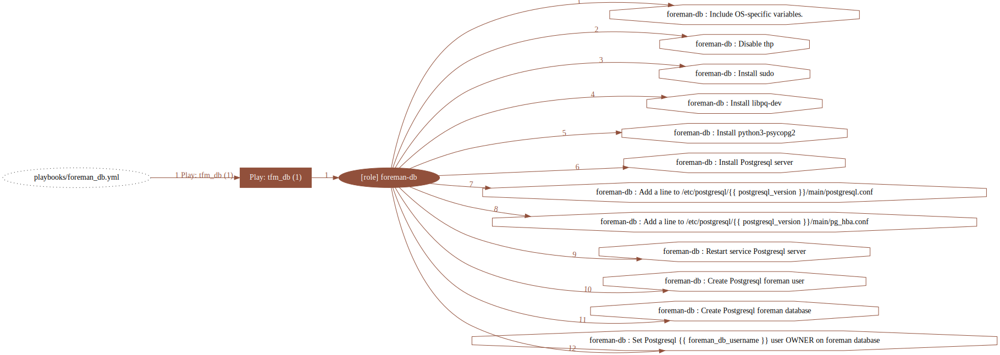
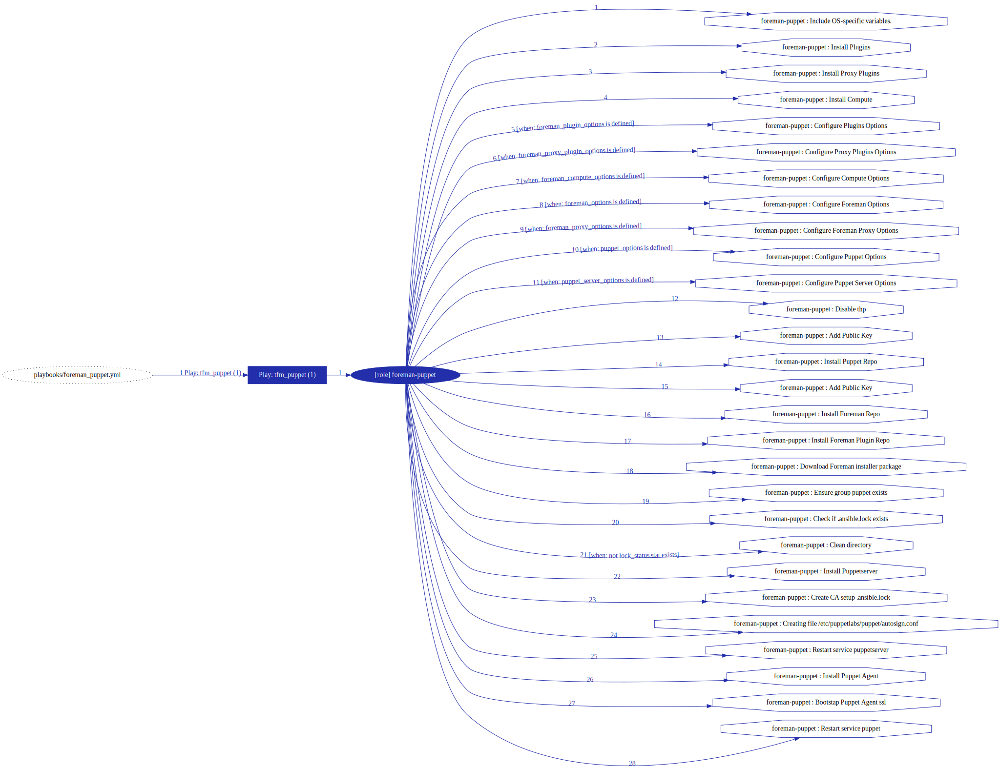
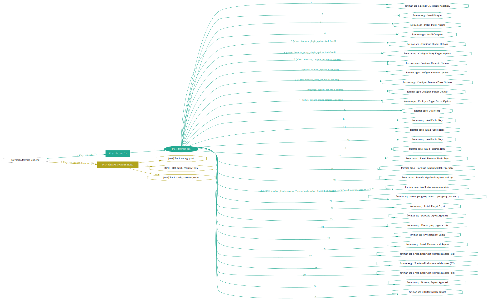
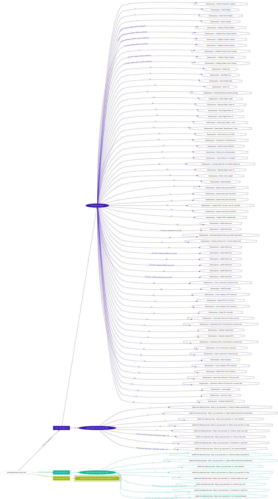
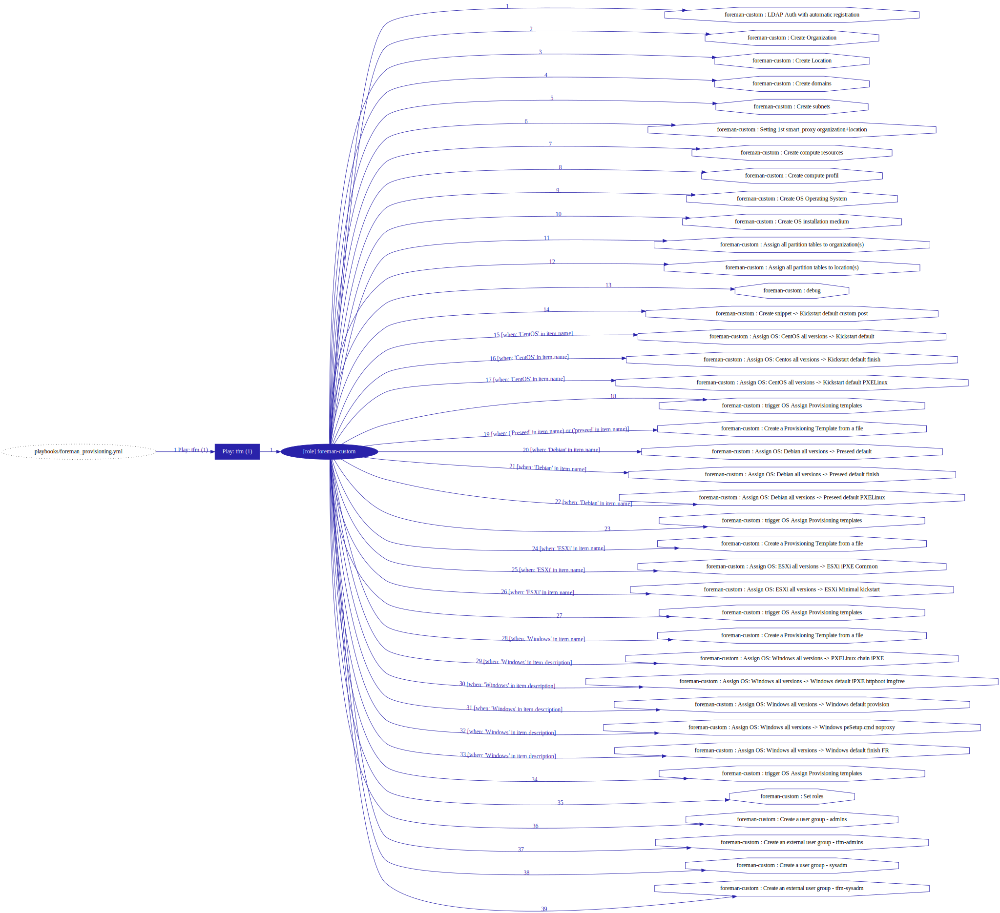
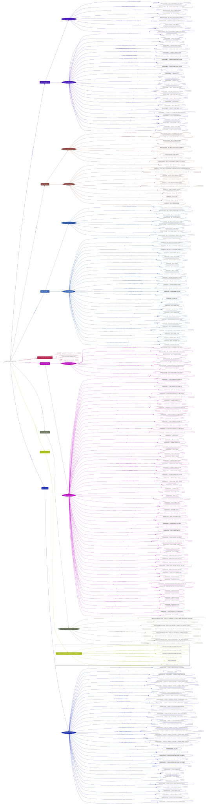

# TFM FOREMAN

One tool to deploy the stack

      +---------------------+
      |      App (code)     |
    ~~+---------------------+~~
      |  Operating System   |
      +---------------------+
      |      (Virtual)      |
    ~~+---------------------+~~
      |      Physical       |
      +---------------------+

### Ansible repo to provision an instance of theforeman with predefined set of parameters

Example:

    ansible-playbook -i inventory/lab playbooks/foreman_deploy.yml

Parameters are defined at inventory/group level.
Be sure to maps your instances to group in inventory

Some visuals

    ansible-playbook-grapher -vvvvvv --include-role-tasks -i inventory/mgmt playbooks/foreman_db.yml

 

    ansible-playbook-grapher -vvvvvv --include-role-tasks -i inventory/mgmt playbooks/foreman_puppet.yml

 

    ansible-playbook-grapher -vvvvvv --include-role-tasks -i inventory/mgmt playbooks/foreman_app.yml

 

    ansible-playbook-grapher -vvvvvv --include-role-tasks -i inventory/mgmt playbooks/foreman_proxy.yml --tags fixdhcp

 

    ansible-playbook-grapher -vvvvvv --include-role-tasks -i inventory/mgmt playbooks/foreman_provisioning.yml --tags provisioning

 

    ansible-playbook-grapher -vvvvvv --include-role-tasks -i inventory/mgmt playbooks/foreman_deploy.yml --tags tfm,fixdhcp,provisioning

 

## Requirements

see requirement.txt