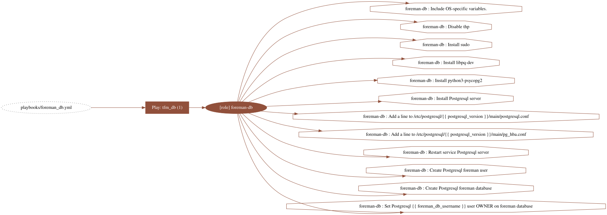
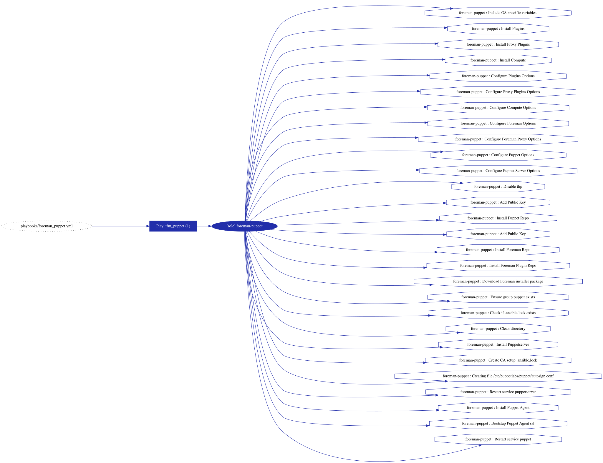
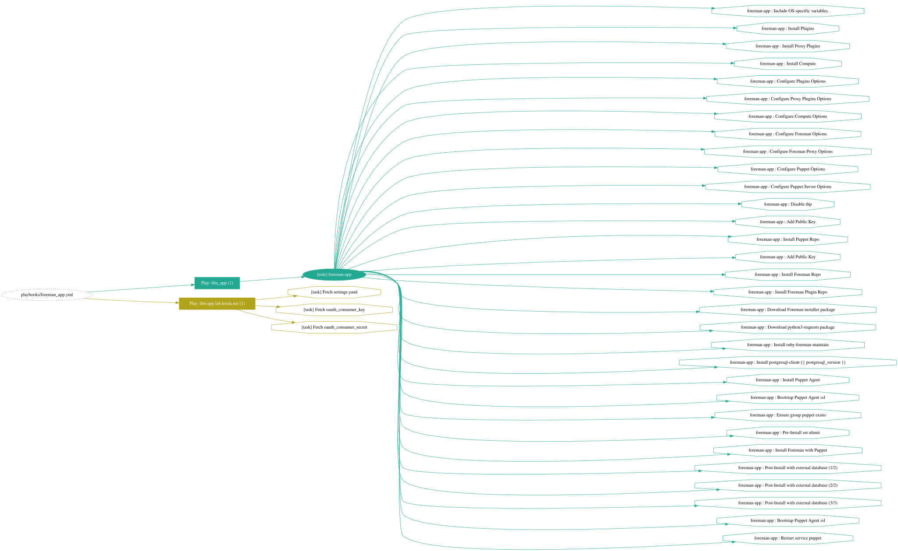
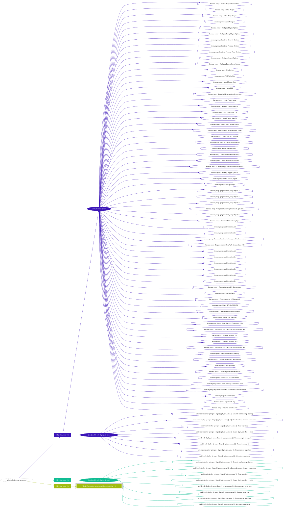
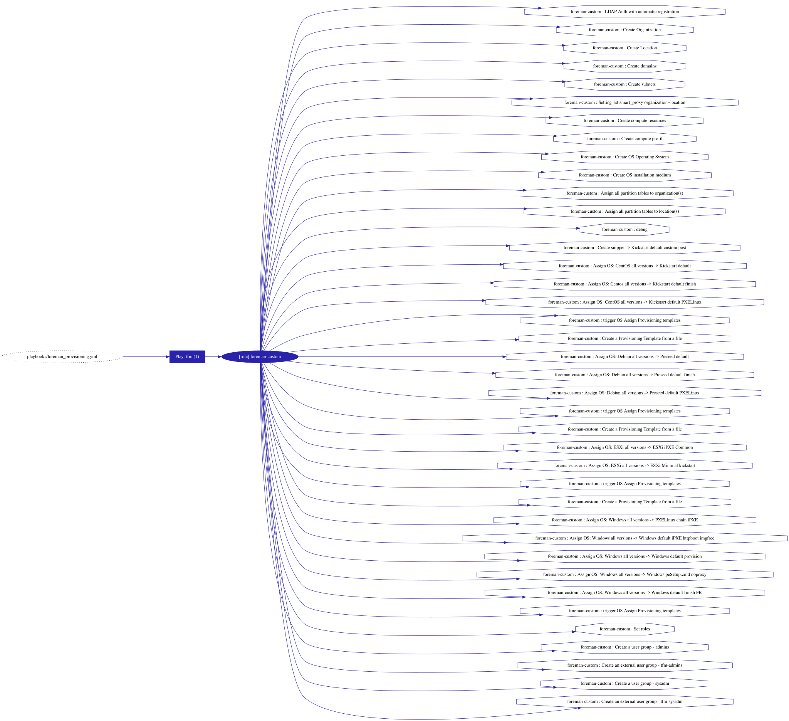
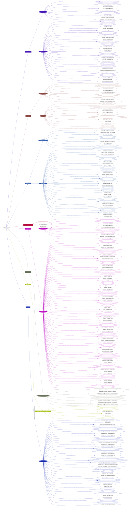

# TFM FOREMAN

One tool to deploy the stack

      +---------------------+
      |      App (code)     |
    ~~+---------------------+~~
      |  Operating System   |
      +---------------------+
      |      (Virtual)      |
    ~~+---------------------+~~
      |      Physical       |
      +---------------------+

### Ansible repo to provision an instance of theforeman with custom set of parameters (deploy & provision)

Setup deployement:

Using a working python environnement, or activate a virtualenv :

```
    pip3 install -r ./requirement.txt
    export ANSIBLE_COLLECTIONS_PATH=./collections
    ansible-galaxy collection install -r roles/requirements.yml
    export ANSIBLE_ROLES_PATH=./roles
    ansible-galaxy role install -r roles/requirements.yml
```

Run examples :
```
# clean environment (ONLY IF YOU NEED SOME CLEANUP)
unset $(set | grep --line-buffered ^ANSIBLE_ | awk -F= '{print $1}')
```
```
# deploy whole
ansible-playbook -i inventory/lab playbooks/foreman_deploy.yml
```
```
# deploy only individual parts
ansible-playbook -i inventory/lab playbooks/foreman_puppet.yml --tags puppet
ansible-playbook -i inventory/lab playbooks/foreman_db.yml --tags db
ansible-playbook -i inventory/lab playbooks/foreman_app.yml --tags app
ansible-playbook -i inventory/lab playbooks/foreman_proxy.yml --tags proxy,oauth

# +fixdhcp for debian>10 with broken omapi in isc-dhcp packaging
ansible-playbook -i inventory/lab playbooks/foreman_proxy.yml --tags proxy,oauth,fixdhcp
```
```
# provisioning
ansible-playbook -i inventory/lab playbooks/foreman_deploy.yml --tags provisioning
```

Parameters are defined at inventory/group level.<br/>
Be sure to maps your instances to group in inventory files.<br/>
Rename files in host_vars accordingly.<br/>

Some macro views:

    ansible-playbook-grapher -vvvvvv --include-role-tasks -i inventory/mgmt playbooks/foreman_db.yml

<br>

    ansible-playbook-grapher -vvvvvv --include-role-tasks -i inventory/mgmt playbooks/foreman_puppet.yml

<br>

    ansible-playbook-grapher -vvvvvv --include-role-tasks -i inventory/mgmt playbooks/foreman_app.yml

<br>

    ansible-playbook-grapher -vvvvvv --include-role-tasks -i inventory/mgmt playbooks/foreman_proxy.yml --tags fixdhcp

<br>

    ansible-playbook-grapher -vvvvvv --include-role-tasks -i inventory/mgmt playbooks/foreman_provisioning.yml --tags provisioning

<br>

    ansible-playbook-grapher -vvvvvv --include-role-tasks -i inventory/mgmt playbooks/foreman_deploy.yml --tags tfm,fixdhcp,provisioning

<br>

## Requirements

see requirement.txt
